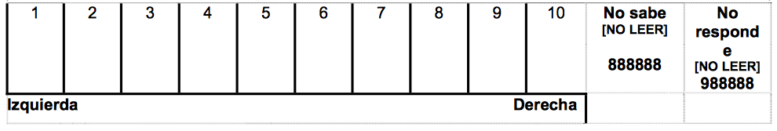

Este proyecto utiliza la base de datos de Fortna, V. P. (2015). Do Terrorists Win? Rebels' Use of Terrorism and Civil War Outcomes. International Organization, 69(3), 519-556. Este estudio trata sobre el terrorismo y sus objetivos políticos. La autora explora la efectividad de los ataques terroristas en un análisis longitudinario en el tiempo, usando modelos logit, Cox y multinomial logit.

##### Antes de comenzar, cargaremos algunos paquetes y abriremos la base de datos en R.

```{r}
library(pacman)
p_load (haven, sjPlot, tidyverse, VGAM, stargazer, MASS, AER, pscl, janitor, stringr, dplyr, mosaic, foreign, survival, rms, survminer, countrycode, forcats, verification)
```

```{r}
data_fortna <- read.dta("fortna_2015_data.dta")
```

La autora busca dilucidar qué tan efectivo es el terrorismo desde una perspectiva distinta a los estudios anteriores: comparando guerras civiles para evaluar si aquellas que presentan grupos rebeldes terroristas han obtenido mejores resultados que otras. Este primer punto es relevante, porque a diferencia de otros estudios que comparan solo actos terroristas para evaluar su efectividad (variabilidad en la variable independiente), más bien acá se busca variabilidad en la variable dependiente, lo que permite un nivel de generalización y confiabilidad de los resultados mucho mayor. Los resultados encontrados indican que el terrorismo no es eficaz: los grupos rebeldes terroristas no suelen alcanzar sus objetivos más grandes, es más, simplemente no ganan directamente. Como señala Fortna, el uso de terrorismo puede ayudar a alcanzar resultados tácticos, pero que no se traducen necesariamente en éxitos estratégicos. Es menos probable que obtengan concesiones en un resultado negociado, incluso en democracias que es el contexto donde teóricamente deberían tener más éxito (pp. 549). En suma, el terrorismo resulta ser poco efectivo debido a que los grupos rebeldes que usan este tipo de tácticas, simplemente no ganan.

Primeramente se busca evaluar qué variables pueden explicar el uso de terrorismo en grupos rebeldes (en guerra civil), para evaluar potenciales "confounding". En el primer modelo, esta variable es utilizada como variable dependiente, pero en el resto del artículo es la principal variable independiente de interés.

Es importante señalar que la autora tiene dos variables que miden terrorismo: "Trebels" y "HCTrebels" (para identificar terrorismos de alto y bajo riesgo, respectivamente). Fortna señala claramente que la variable a utilizar corresponde a "HCTrebels" debido a que es una medida de terrorismo más restrictiva y por tanto es capaz de capturar mejor la definición propuesta de terrorismo como manera deliberada e indiscriminada.

```{r}
data_fortna %>%
  tabyl(HCTrebels)
```

Como se observa, hay 307 observaciones donde los rebeldes usan una estrategia sistemática de terrorismo de alto nivel, mientras que en 708 observaciones no lo hacen. La autora señala que de los 104 casos que trabaja, en un 23% de casos hay uso de este tipo de estrategias. Lo anterior puede ser visto en la siguiente tabla que resume los 104 casos con la cantidad de actos terroristas de alto nivel.

```{r}
aggregate (HCTrebels ~ VPFid, data = data_fortna, FUN ="sum")
```

Como se observa, cuando en los casos se presentan este tipo de estrategias terroristas de alto nivel, en general es usada no uno sino durante varios años. En los casos donde se da, en promedio se registran estos actos durante 12 años.

```{r}
(2 + 11 + 38 + 6 + 6 + 6 + 11 + 15 + 3 + 11 + 29 + 4 + 11 + 8 + 13 + 32 + 22 + 14 + 10 + 2 + 5 + 13 + 10 + 24 + 1) / 24
```

También podemos observar que son 24 casos donde se usó una estrategia sistemática de terrorismo de alto nivel.

```{r}
aggregate (firstob ~ HCTrebels, data = data_fortna, FUN ="sum")
```

El segundo modelo de la autora utiliza como variable dependiente la duración de la guerra civil. Se corre un modelo de supervivencia por lo que, como veremos más adelante, deberemos calcular también los tiempos de riesgo. No obstante lo anterior, para este análisis descriptivo ocuparemos la variable "warends" que en el modelo de supervivencia representaría entonces la "muerte": cuando la guerra termina, por tanto, la duración de la misma.

```{r}
data_fortna %>%
  tabyl(warends)
```

Como se observa, en 86 de los casos se registra el fin de la guerra. El valor "cero" no lo podemos interpretar, porque dicho valor puede estar muchas veces en las observaciones y pertenecer al mismo caso (solo que a distintos años).

Por último, la Tabla 3 realiza un logit multinomial que tiene como variable dependiente la variable de outcome: "outcomeF", y toma como categoría base "ongoing".

```{r}
data_fortna %>%
  tabyl(outcomeF)
```

Como se observa, en 9 casos hubo victoria del gobierno, en 18 hubo baja actividad, en 44 hubo un acuerdo negociado y en 16 una victoria de los rebeldes. Se desprende que en los 17 casos restantes siguió habiendo guerra (categoría "en marcha" u "ongoing"). El "n" en esta categoría es de 928, lo que no resulta raro debido a que mientras la guerra esté en marcha el valor en esta variable será siempre 2 en todos los años y dentro de un mismo caso.

Respecto a problemas de confounding, la autora reconoce un posible sesgo de selección debido a que ella se concentra solo en terrorismo en el contexto de guerra civil y no en "todas las organizaciones terroristas", por tanto, resulta entendible que sus resultados puedan ser extrapolados solo al contexto de guerra civil. Sin embargo, para la autora uno de los problemas principales que podría desprenderse de sus análisis es el problema de un posible confounding, es decir: estar omitiendo alguna variable que pueda afectar tanto al uso de terrorismo como al resultado de la guerra (pp.532). En ese sentido, la posible variable "confounding" más evidente podría ser la fuerza del grupo rebelde en relación al gobierno; pero también hay otras: se menciona a la democracia, el extremismo de los grupos, conflicto religioso, población, PIB, entre otros. Si bien según Fortna puede haber millones de otras variables que puedan afectar las probabilidades de que los grupos rebeldes eligan terrorismo, ella se centra en las antes mencionadas por ser variables que según sus suposiciones también podrían afectar el resultado de la guerra, y por tanto ser confounders. Como veremos más adelante, la autora agrega cada una de estas variables a los modelos como variables de control para así evitar este problema, además de correr un modelo logit (el cual replicaremos en el próximo punto), con el fin de identificar si algunas de éstas explican significativamente el uso de terrorismo en grupos rebeldes.

Como se mencionó anteriormente, el primer modelo del estudio de Fortna busca dilucidar las variables que podrían explicar el uso de terrorismo en grupos rebeldes (en guerra civil). Con esto, se busca poder abordar el tema de posibles confounders. En el resto del artículo, esta variable se transforma en la variable independiente de principal interés.

Replicaremos este primer modelo considerando todas las variables que Fortna considera. Para replicar esta tabla, primero haremos un subset que solo tome las observaciones donde la variable firstob sea igual a 1, ya que la autora toma la primera observación de cada caso para realizar esta regresión logística (la cual está expresada por la variable firstob).

```{r}
fortna_1obs <- subset(data_fortna, firstob==1)
```

Ahora corremos la regresión:

```{r}
modelo_logit <- glm(HCTrebels ~ o_rebstrength + demdum + independenceC + transformC + diffreligion + lnpop + lngdppc + africa + lnmtnest + act2,
                           data = fortna_1obs,
                           family = binomial("logit"))

summary(modelo_logit, cluster = c("js_countryid"))

stargazer(modelo_logit, cluster = c("js_countryid"),
                      type    = "text",
                      report  = "vc*p",
                      title   = "Replicación de Modelo Logit de Fortna"
                      )
```

```{r, eval = F}
stargazer(modelo_logit, cluster = c("js_countryid"),
                      type   = "html",
                      out    = "modelo_logit.html",
                      report = "vc*p",
                      title  = "Replicación de Modelo Logit de Fortna")
```

Como se observa, los resultados obtenidos son bastante parecidos a los obtenidos por Fortna. Los coeficientes son casi iguales y la variable democracia es la única que resulta significativa. Graficaremos las probabilidades predichas para esta variable:

```{r}
sjp.glm(modelo_logit,
        type        = "pred",
        show.ci     = TRUE,
        vars        = "demdum")
```

Como se observa, la pendiente es positiva y con valores de democracia de 0.8 las probabilidades predichas son de casi un 50% para la variable HCTrebels. Graficaremos también los efectos marginales:

```{r}
sjp.glm(modelo_logit,
        type        = "eff",
        show.ci     = TRUE,
        vars        = "demdum",
        title       = "Efectos marginales - Modelo logit de Fortna")
```

La gráfica de efectos marginales no nos dice mucho. Esto se puede deber a que exista un problema de escalamiento (por tanto de 0% a 100% no se logren ver los efectos marginales).

Ahora replicaremos el segundo modelo. Primero crearemos las variables que representen el "tiempo en riesgo" de cada observación:

```{r}
data_fortna <- data_fortna %>%
  mutate(enddate20091 = as.double(str_extract(enddate2009, ".{4}")))
```

```{r}
data_fortna_superv <- data_fortna %>%
  group_by(VPFid) %>%
  filter(enddate20091 != min(enddate20091)) %>%
  mutate(risk_time_at_end   = c(1:n()),
         risk_time_at_start = c(0:(n() - 1))) %>%
  ungroup()
```

Con las variables creadas, corremos el modelo:

```{r, warning = FALSE, message = FALSE}
modelo_cox <- coxph(Surv(risk_time_at_start, risk_time_at_end, warends) ~ 
                  HCTrebels + o_rebstrength + demdum + independenceC + transformC + lnpop + lngdppc + africa + diffreligion + warage,
                data   = data_fortna_superv,
                robust = TRUE,
                method ="breslow")
```

A continuación vemos si se viola el supuesto de proporcionalidad de los riesgos.

```{r, warning = FALSE, message = FALSE}
cox.zph(modelo_cox)
```

Como se observa, este presupuesto no se viola. Por tanto, pasamos graficar los resultados en una tabla.

```{r}
stargazer(modelo_cox,
          type = "text",
          coef = list(exp(coef(modelo_cox))),
          se   = list(exp(summary(modelo_cox)$coefficients[, 3])),
          report = "vc*p",
          notes = "Hazard ratios")
```

Como se observa, aquí obtenemos los Hazard Ratios, pero los valores p no nos dicen mucho pues tendríamos que utilizar los mismos que obtenemos del primer modelo (donde la variable HCTrebels y africa resultan significativas). La tabla arreglada (con los valores p del primer modelo), se presentará en el archivo pdf de las tablas que se adjunta a este documento.

```{r, eval = F}
stargazer(modelo_cox,
                      type   = "html",
                      out    = "modelo_cox.html",
                      coef   = list(exp(coef(modelo_cox))),
                      se     = list(exp(summary(modelo_cox)$coefficients[, 3])),
                      report = "vc*p",
                      title  = "Modelo de Supervivencia - Hazard Ratios")
```

Ahora estimamos la curva de supervivencia no-paramétrica, para poder graficar la curva de supervivencia.

```{r}
curva_km <- npsurv(Surv(time = risk_time_at_start, time2 = risk_time_at_end,
                        event = warends) ~ HCTrebels,
                   type = "kaplan-meier", conf.type = "log",
                   data = data_fortna_superv)
summary(curva_km)
```

```{r}
ggsurvplot(curva_km, conf.int = T, legend = "right", legend.title = "",
           risk.table = T,
           break.x.by = 10,
           legend.labs = c("No terrorismo de alto riesgo = 0", "Terrorismo de alto riesgo = 1"),
           data = data_fortna_superv) +
  labs(title    = "Kaplan-Meir Survival estimates")
```

De acuerdo al modelo de Cox estimado anteriormente, tal como sostiene la autora los hazard ratios inferiores a 1 indican variables asociadas a guerras más largas, aquellos que tienen valores de 1 indican asociaciones a guerras más cortas. Dados los resultados, la variable de interés "terrorismo de alto riesgo" estaría asociado a guerras de larga duración, debido a que presenta un hazard ratio de 0.43.

Casi al comienzo del paper la autora propone un esquema donde el éxito político de los grupos rebeldes estaría representado por un continuum desde "Government victory" hasta "Rebel victory", como se observa en la siguiente figura:


Si se piensa de esa manera, entonces uno podría argumentar que la variable que incluye estos outcomes ("outcomeF") si presenta un orden y por tanto no sería adecuado utilizar un modelo logit multinomial para las estimaciones debido a que este modelo se construye en base a una variable categórica no-ordenada. Sin embargo, Fortna posteriormente sostiene dos cosas: primero, que esta idea de "orden" de los outcomes es un argumento propio más que un hecho de por sí. En segundo lugar, considera que el efecto del terrorismo sobre los resultados no sería monotónico. Dado lo anterior es que no se hace ningún supuesto sobre el orden de los outcomes, y por tanto al no ser categorías ordenadas se corre el modelo multinomial con la categoría "ongoing" de base.

Si bien los coeficientes de los modelos logit multinomial son difíciles de interpretar por sí solos, si nos pueden entregar información importante respecto de la dirección y significancia de los coeficientes: por ejemplo, existe una relación negativa entre grupos terroristas de alto riesgo con guerras que terminan con acuerdos negociados y con victorias de los rebeldes (ambos coeficientes significativos), en comparación a guerras en curso. En relación a la democracia por ejemplo, existe una relacion negativa entre esta variable y las guerras que terminan con victorias de los rebeldes, en comparación a las guerras en curso.

# Apuntes teóricos

Los modelos de supervivencia se utilizan cuando lo que nos interesa tiene que ver con la duración y momento de ocurrencia de un evento. Estos se pueden dividir entre modelos de supervivencia paramétricos y modelos de supervivencia no-paramétricos.

La diferencia entre ambos está dada porque los modelos de supervivencia paramétricos hacen ciertos supuestos sobre la población que los modelos no-paramétricos no hacen. Principalmente, los modelos paramétricos suponen a partir del "baseline hazard", es decir, de que el evento ocurra cuando las variables independientes están en cero. A diferencia de lo anterior, los modelos semi-paramétricos no hacen supuestos a partir de la función de base, sino que simplemente se estima a partir de los datos. Mientras que el modelo de Weibull corresponde a un modelo de supervivencia paramétrico, el modelo de Cox es un modelo de supervivencia semi-paramétrico.

Dado lo anterior, es posible afirmar también que el modelo de Cox presenta tres ventajas principales en relación a los modelos paramétricos:

1. Mejor modelaje del riesgo de base
2. Solidez en el presupuesto de los riesgos proporcionales
3. Mejor manejo de datos "empatados"

En suma, los modelos semi-paramétricos resultan más flexibles dado que no están sujetos a restricciones respecto a cómo se distribuye la función de riesgo base.

En los modelos de supervivencia, la función de supervivencia, la ocurrencia de un evento dado un tiempo T y la tasa de riesgo (hazard rate) están interrelacionados. Aquello debido a que la función de supervivencia es la probabilidad de la duración de la observacion T haya sobrepasado el límite de tiempo t, mientras que la función de riesgo es la probabilidad de que la observación "muera" a lo largo del tiempo. Por tanto, el hazard rate va a depender tanto por la función de supervivencia como de la función de densidad de la probabilidad, como muestra la siguiente figura:


En palabras simples, la interrelación viene dada porque el hazard rate de una observación dependerá tanto de la probabilidad de supervivencia de la misma, como de la probabilidad de que ocurra el evento.

Los modelos de variables censuradas o truncadas se utilizan cuando nos interesa una variable latente y*. Cuando una variable está truncada es cuando tenemos datos solo para un subconjunto de la población total, y por tanto tenemos un problema de selección. Por ejemplo, si queremos hacer un estudio en la UC para saber los efectos del período académico en las visitas psicológicas de estudiantes. Podemos tener una variable truncada si recolectamos información solo a partir de quienes registraron visitas psicológicas, debido a que todas aquellas observaciones partirían de 1 hacia arriba. Es decir, no serían considerados aquellos individuos que simplemente no registraron visitas psicológicas.

Por otro lado, la censura supone un defecto de los datos de la muestra, donde solo sabemos que la variable es mayor o menor a un valor pero no tenemos valores fuera de esos límites. Es decir, los valores en cierto rango se reportan con un mínimo (o máximo) de valor cuando en realidad podría haber tomado valores mucho más bajos (lower level) o altos (upper level) que los reportados. Por ejemplo, la clásica pregunta contenida en la encuesta LAPOP respecto a la posición política del entrevistado:

"Cambiando de tema, en esta tarjeta tenemos una escala del 1 a 10 que va de izquierda a derecha, en la que el 1 significa izquierda y el 10 significa derecha. Hoy en día cuando se habla de tendencias políticas, mucha gente habla de aquellos que simpatizan más con la izquierda o con la derecha. Según el sentido que tengan para usted los términos "izquierda" y "derecha" cuando piensa sobre su punto de vista político, ¿dónde se encontraría usted en esta escala? Dígame el número"



En este caso tenemos dos opciones de variables censuradas: aquellos que respondieron con el valor 1 (izquierda) y que en realidad si hubiesen existido valores -2, -3 o -5 se hubiesen posicionado allí; y aquellos que respondieron con el valor 10 (derecha) y que en realidad se hubiesen posicionado en valores mucho más altos si hubiese existido la opción de poder hacerlo.